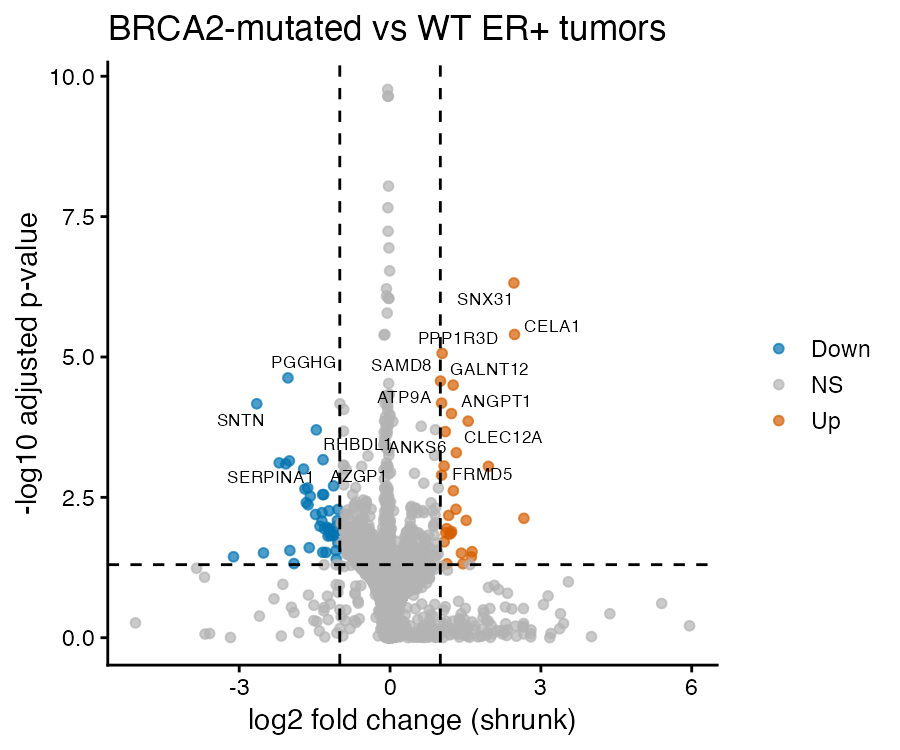
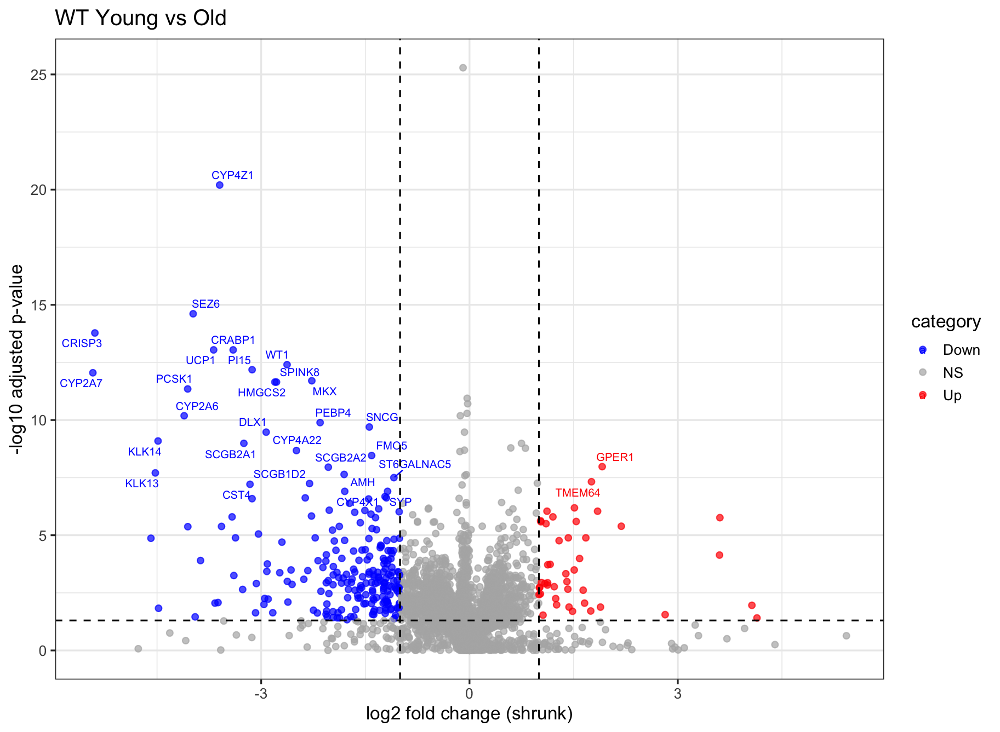

# ER+ BRCA2 Breast Cancer Transcriptomics

Transcriptomic analysis of ER-positive breast cancer in TCGA.

RNA-seq analysis of TCGA-BRCA tumors focusing on ER+ BRCA2 mutation carriers.

---

## Objectives

1. Compare ER+ BRCA2-mutated vs wild-type tumors
2. Compare young vs older ER+ tumors
3. Identify pathways associated with aggressive ER+ BRCA2 tumors

---

## Data

Source: TCGA-BRCA RNA-seq (STAR counts)

Downloaded using:
TCGAbiolinks

---

## Pipeline

1. Download TCGA RNA-seq data  
2. Clinical filtering (ER+, female)  
3. Patient-level count collapsing  
4. DESeq2 differential expression  
5. Hallmark pathway analysis (fgsea)  
6. ssGSEA pathway scoring  

---

## Additional metadata

BRCA2 mutation carriers were defined using curated mutation annotations.

The files `yost_table_12.xlsx` and `maxwell_germline.xlsx` contain the list of BRCA2 mutation carriers used in this analysis.

---
## Results

### Differential expression: BRCA2-mutated vs WT (ER+)

Volcano plot showing differential gene expression between BRCA2-mutated and wild-type ER-positive breast tumors.

**Key observation:**  
Differential expression is driven by a relatively small subset of genes with strong effect sizes, rather than a global shift in the transcriptome. This is consistent with a structured but subtle transcriptional phenotype in BRCA2-mutated tumors.

---

### Biological interpretation

These findings align with a model where BRCA2-mutated ER+ tumors do not form a completely distinct transcriptional cluster, but instead exhibit targeted dysregulation of specific pathways. As shown in our analysis  [oai_citation:0‡GREIN 3_nyjast.docx](file-service://file-932ajgEjLdVrL1r2qXT4H3), this type of pattern reflects coordinated biological programs (e.g., proliferation, metabolic rewiring, EMT) rather than widespread gene-level changes.

---

### Differential expression: Young vs Older (WT)

Comparison of gene expression between young (≤40 years) and older ER+ wild-type tumors.

**Key observation:**  
Age-associated transcriptional changes in wild-type tumors reflect coordinated biological processes rather than widespread global shifts. These include pathways related to proliferation, metabolism, and cellular stress responses, suggesting a structured aging-related transcriptional program in ER+ breast cancer.

### PCA – global transcriptomic structure

Samples do not clearly separate by BRCA2 status or age at a global level.

---

### Differential expression: BRCA2 effect within age groups

Comparison of BRCA2-mutated vs wild-type tumors stratified by age.

#### Young patients

#### Older patients

**Key observation:**  
The transcriptional impact of BRCA2 mutations differs by age. In older patients, BRCA2-mutated tumors show a clearer and more structured transcriptional signal. In contrast, in young patients, the signal is weaker and less consistent, suggesting that BRCA2-associated tumor biology may be fundamentally different in early-onset disease.

######Interaction (This is basically the main story)
---

### Interaction: Age × BRCA2 status

To assess whether the effect of BRCA2 mutations differs by age, an interaction model was applied.

**Key observation:**  
A subset of genes shows significant interaction between age and BRCA2 status, indicating that the effect of BRCA2 mutations is not constant across age groups. Instead, BRCA2-associated transcriptional changes are modified by age, supporting the idea that tumor biology differs between young and older patients.

### Concordance analysis: Aging vs BRCA2-associated transcription

We compared age-associated gene expression changes in wild-type tumors to those observed in BRCA2-mutated tumors.

**Key observation:**  
In older patients, BRCA2-mutated tumors show moderate similarity to age-related transcriptional programs. However, in young patients, there is minimal overlap and even opposite patterns of gene expression.

These results suggest that BRCA2-mutated tumors in young individuals are driven by distinct biological mechanisms rather than representing an accelerated form of aging.

### Pathway-level comparison (GSEA)

To compare pathway-level changes, GSEA was performed using ranked gene lists from key contrasts.

**Key observation:**  
Pathway-level analysis confirms the gene-level findings. While some pathways show concordant behavior in older patients, several pathways in young patients display divergent or opposite enrichment patterns.

This further supports the idea that BRCA2-mutated tumors in young patients follow a distinct biological program.

## Author
Snædís Ragnarsdóttir  
PhD student – University of Iceland
