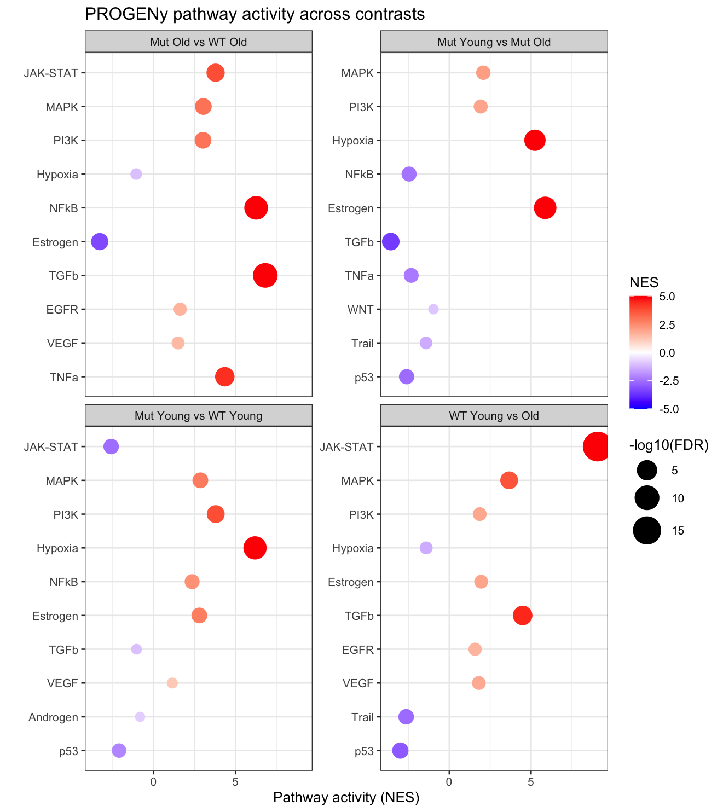

# ER+ BRCA2 Breast Cancer Transcriptomics

Transcriptomic analysis of ER-positive breast cancer in TCGA, with a focus on BRCA2 mutation carriers and age-dependent tumor biology.

---

## Objectives

1. Compare ER+ BRCA2-mutated vs wild-type tumors  
2. Compare young vs older ER+ tumors  
3. Determine whether BRCA2-associated transcriptional programs differ by age  
4. Identify pathways linked to aggressiveness in ER+ BRCA2-mutated tumors  

---

## Data

**Source:** TCGA-BRCA RNA-seq (STAR counts)  
Downloaded using: `TCGAbiolinks`

---

## Pipeline

1. Download TCGA RNA-seq data  
2. Clinical filtering (ER+, female patients)  
3. Patient-level count collapsing  
4. Gene filtering (low-expression removal using edgeR)  
5. Differential expression analysis (DESeq2)  
6. Effect size shrinkage (apeglm / ashr where appropriate)  
7. Pathway analysis:
   - Hallmark GSEA (fgsea)
   - TF activity inference (decoupleR / DoRothEA)
   - Pathway activity inference (PROGENy)  
8. Concordance analysis across contrasts  

---

## Additional metadata

BRCA2 mutation carriers were defined using curated mutation annotations.

The files `yost_table_12.xlsx` and `maxwell_germline.xlsx` contain the mutation carrier lists used in this analysis.

---

# Results

---

## Differential expression: BRCA2-mutated vs WT (ER+)

Volcano plot showing differential gene expression between BRCA2-mutated and wild-type ER-positive tumors.

**Key observation:**  
Differential expression is driven by a relatively small subset of genes with strong effect sizes, rather than a global transcriptomic shift. This suggests a structured and pathway-specific phenotype in BRCA2-mutated tumors.

---

## Biological interpretation

BRCA2-mutated ER+ tumors do not form a completely distinct transcriptional cluster. Instead, they exhibit targeted dysregulation of specific biological programs (e.g., proliferation, metabolism, EMT), rather than widespread gene-level changes.

---

## Differential expression: Young vs Older (WT)

Comparison of gene expression between young (≤40 years) and older ER+ wild-type tumors.

**Key observation:**  
Age-associated transcriptional changes reflect coordinated biological programs, including proliferation, metabolism, and stress responses. This indicates that aging introduces structured transcriptional changes rather than random variation.

---

## PCA – global transcriptomic structure

Samples do not clearly separate by BRCA2 status or age at a global level.

---

## Differential expression: BRCA2 effect within age groups

Comparison of BRCA2-mutated vs wild-type tumors stratified by age.

### Young patients

### Older patients

**Key observation:**  
The transcriptional impact of BRCA2 mutations is strongly age-dependent.  
- In older patients, BRCA2-mutated tumors show a clearer and more consistent transcriptional signal  
- In young patients, the signal is weaker and more heterogeneous  

This suggests that BRCA2-driven tumor biology differs between early-onset and later-onset disease.

---

## Interaction: Age × BRCA2 status

An interaction model was used to directly test whether the effect of BRCA2 mutations depends on age.

**Key observation:**  
A subset of genes shows significant interaction between age and BRCA2 status, indicating that BRCA2-associated transcriptional changes are modified by age rather than being constant across patients.

---

## Concordance analysis: Aging vs BRCA2-associated transcription

Comparison of age-associated gene expression changes in wild-type tumors with BRCA2-mutated tumors.

  

**Key observation:**  
- Older BRCA2-mutated tumors partially recapitulate age-related transcriptional programs  
- Young BRCA2-mutated tumors show minimal overlap and often opposite patterns  

This suggests that BRCA2-mutated tumors in young individuals arise through distinct biological mechanisms, rather than representing accelerated aging.

---

## Pathway-level analysis (GSEA)

Gene set enrichment analysis was performed using ranked gene lists.

**Key observation:**  
Pathway-level analysis mirrors gene-level findings:
- Moderate concordance in older patients  
- Divergent or opposite pathway activity in young patients  

This reinforces the presence of distinct biological programs in early-onset BRCA2-mutated tumors.

---

## Transcription factor activity (DoRothEA / decoupleR)

Transcription factor activity inference identified regulatory programs underlying observed gene expression changes.

**Key observation:**  
Key transcriptional regulators show differential activity across contrasts, suggesting that upstream regulatory networks (e.g., proliferation, stress response, hormone signaling) are rewired in BRCA2-mutated tumors in an age-dependent manner.

---

## Pathway activity (PROGENy)

**Key observation:**  
PROGENy analysis highlights differential activation of signaling pathways across contrasts, further supporting the existence of distinct biological states between:
- young vs older tumors  
- BRCA2-mutated vs wild-type tumors  

---

# Overall conclusion

Together, these analyses demonstrate that:

- BRCA2-mutated ER+ tumors are not defined by a global transcriptional shift, but by targeted pathway dysregulation  
- Age is a critical modifier of BRCA2-associated tumor biology  
- BRCA2-mutated tumors in young patients represent a biologically distinct subtype  

These findings support a model in which early-onset BRCA2-mutated breast cancer arises through mechanisms that differ from both:
- sporadic aging-related tumor development  
- BRCA2-mutated tumors in older individuals  

---

## Author

Snædís Ragnarsdóttir  
PhD student – University of Iceland
